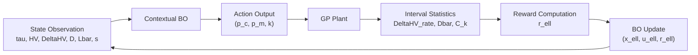

# 提案手法仕様メモ V1

- 作成日: 2026-04-27
- 位置づけ: 提案手法の**正規版仕様メモ**
- 目的: 論文・研究ノート・今後の実装検討で共通に参照するため、提案手法を「数理定義」「アルゴリズム」「主張と仮説」の 3 点で固定する
- 関係文書:
  - 主ノート: [research_note.md](/Users/kakemyo/Downloads/master_BOGP/notes/research_note.md)
  - ラフ版: [proposed_method_rough.md](/Users/kakemyo/Downloads/master_BOGP/notes/proposed_method_rough.md)

## 1. 手法の一文定義

本研究の提案法は、**GP の世代状態を文脈として観測し、交叉率 `p_c`、突然変異率 `p_m`、次回再調整までの世代数 `k` を、文脈付きベイズ最適化で逐次決定する状態依存・閉ループ制御**である。

提案法の本質は、固定率の置き換えではなく、**探索状態に応じて操作強度と制御周期を同時に切り替えること**にある。

## 2. 数理定義

### 2.1 時間軸と記号

本手法では 2 種類の時間軸を分ける。

- `g`: GP の世代番号
- `\ell`: 外側 BO が介入する制御更新ステップ番号

`k_\ell` 世代ごとに 1 回制御更新するため、一般に

$$
g_{\ell+1} = g_\ell + k_\ell
$$

である。

### 2.2 プラント

世代 `g` における GP 集団を `P_g` とする。GP は、制御入力

$$
u_\ell =
\begin{bmatrix}
p_{c,\ell} \\
p_{m,\ell} \\
k_\ell
\end{bmatrix}
$$

を受けて `k_\ell` 世代だけ進化するプラントとみなす。

制御ステップ `\ell` における集団遷移は

$$
P_{g_{\ell+1}} = F(P_{g_\ell}, u_\ell, \xi_\ell)
$$

と表す。ここで `F` は選択・交叉・突然変異・評価を含む GP の進化作用全体、`\xi_\ell` は確率的ゆらぎである。

### 2.3 状態

外側 BO に渡す状態ベクトルを

$$
x_\ell =
\left[
\tau_\ell,\;
\widetilde{HV}_\ell,\;
\widetilde{\Delta HV}_\ell,\;
D_\ell,\;
\widetilde{L}_\ell,\;
\widetilde{s}_\ell
\right]^\top
$$

とする。

各成分は次のように定義する。

$$
\tau_\ell = \frac{g_\ell}{T}
$$

$$
\widetilde{HV}_\ell =
\mathrm{clip}
\left(
\frac{HV_\ell - HV_{\min}}{HV_{\max} - HV_{\min}},
0, 1
\right)
$$

$$
\widetilde{\Delta HV}_\ell =
\mathrm{clip}
\left(
\frac{HV_\ell - HV_{\ell-1}}{\delta_{HV}},
-1, 1
\right)
$$

$$
\widetilde{L}_\ell =
\mathrm{clip}
\left(
\frac{\bar{L}_\ell}{L_{\mathrm{ref}}},
0, 1
\right)
$$

$$
\widetilde{s}_\ell =
\mathrm{clip}
\left(
\frac{s_\ell}{s_{\max}},
0, 1
\right)
$$

ここで、

- `HV_\ell`: 更新時点のハイパーボリューム
- `D_\ell`: 更新時点の多様性
- `\bar{L}_\ell`: 更新時点の平均木サイズ
- `s_\ell`: 更新時点の停滞長

である。

多様性 `D_\ell` の第一候補は構造多様性とし、集団 `P_{g_\ell} = \{T_1,\dots,T_{N_\ell}\}` に対して

$$
D_\ell
=
1
-
\frac{2}{N_\ell(N_\ell-1)}
\sum_{1 \le i < j \le N_\ell}
Sim_g(T_i,T_j)
$$

$$
Sim_g(T_i,T_j)
=
\frac{|M(T_i,T_j)|}{|T_i| + |T_j| - |M(T_i,T_j)|}
$$

と定義する。

### 2.4 行動

行動は

$$
u_\ell = (p_{c,\ell}, p_{m,\ell}, k_\ell)
$$

であり、`(p_c, p_m)` に加えて `k` も制御対象に含める。

制約集合は

$$
\mathcal{U}(x_\ell)
=
\left\{
(p_c,p_m,k)
\mid
p_c \in [p_c^{\min}, p_c^{\max}],
\;
p_m \in [p_m^{\min}, p_m^{\max}],
\;
k \in \mathcal{K},
\;
p_c + p_m \le 1
\right\}
$$

とする。

ここで `\mathcal{K}` は `k` の候補集合であり、初稿では

$$
\mathcal{K} = \{k^{(1)}, k^{(2)}, \dots, k^{(M)}\}
$$

のような有限離散集合とする。

`k` は単なる効率化変数ではなく、

- 状態が安定しているときは更新を粗くする
- 状態変化が大きいときは更新を密にする

ための**適応的な制御更新周期**として位置づける。

### 2.5 報酬

報酬は単一スカラーで整理し、

- 主項: 進捗
- 副項: 多様性維持
- 抑制項: 制御更新コスト

とする。

ただし、`k` を行動に入れる以上、区間総改善量

$$
HV_{\ell+1} - HV_\ell
$$

をそのまま使うと、大きな `k` が有利になりやすい。そこで主進捗項は**世代あたり改善量**で定義する。

$$
\Delta HV^{\mathrm{rate}}_\ell
=
\frac{HV_{\ell+1} - HV_\ell}{k_\ell}
$$

$$
\widetilde{\Delta HV}^{\mathrm{rate}}_\ell
=
\mathrm{clip}
\left(
\frac{\Delta HV^{\mathrm{rate}}_\ell}{\delta_{HV}^{\mathrm{rate}}},
-1, 1
\right)
$$

多様性項には**区間平均多様性**を使う。

$$
\bar{D}_\ell
=
\frac{1}{k_\ell}
\sum_{j=1}^{k_\ell}
D_{\ell,j}
$$

ここで `D_{\ell,j}` は、制御区間 `\ell` の中の `j` 世代目における多様性である。

目標多様性は

$$
D^\ast(\tau)
=
D_{\mathrm{start}}
-
(D_{\mathrm{start}} - D_{\mathrm{end}})\tau
$$

とし、多様性整合度を

$$
S_D(\bar{D}_\ell, \tau_{\ell+1})
=
\exp
\left(
-
\left(
\frac{\bar{D}_\ell - D^\ast(\tau_{\ell+1})}{\sigma_D}
\right)^2
\right)
$$

と定義する。

制御コスト項は

$$
C_k(k_\ell)
=
\frac{k_{\max} - k_\ell}{k_{\max} - k_{\min}}
$$

とする。更新頻度が高い、すなわち `k` が小さいほどコストが大きい。

したがって最終報酬は

$$
r_\ell
=
w_p \widetilde{\Delta HV}^{\mathrm{rate}}_\ell
+
w_d S_D(\bar{D}_\ell, \tau_{\ell+1})
-
w_c C_k(k_\ell)
$$

とする。

ここで、初稿では主張の重心を明確にするため

$$
w_p > w_d > w_c
$$

を方針として置く。性能対多様性の両立が中心であり、制御コストは弱い抑制項にとどめる。

### 2.6 制御器

制御器は、標準的な GP ベースの文脈付き BO とする。入力は状態と行動の結合ベクトル、出力は報酬である。

$$
z_\ell = [x_\ell, u_\ell]
$$

$$
r_\ell = f(z_\ell) + \varepsilon_\ell
$$

履歴データを

$$
\mathcal{D}_n = \{(z_i, r_i)\}_{i=1}^{n}
$$

とすると、BO は

$$
f(z) \sim \mathcal{GP}(m(z), K(z,z'))
$$

を学習する。

現在状態 `x_\ell` を固定した上で、次行動は

$$
u_\ell^\ast
=
\arg\max_{u \in \mathcal{U}(x_\ell)}
\mathrm{EI}(x_\ell, u \mid \mathcal{D}_\ell)
$$

で選ぶ。

ここで重要なのは、最適化しているのが

$$
f(p_c,p_m,k)
$$

ではなく、

$$
f(x_\ell,p_c,p_m,k)
$$

である点である。これが非文脈 BO との差分の中心になる。

### 2.7 BO と GP の接続

BO と GP の接続仕様は次の通りに固定する。

- BO への入力:
  - 更新時点 `g_\ell` で観測した状態 `x_\ell`
- BO の出力:
  - `u_\ell = (p_c, p_m, k)`
- GP プラントへの入力:
  - 制御区間 `\ell` の間ホールドされる `p_c, p_m`
  - 次回更新までの世代数 `k`
- GP プラントから返るもの:
  - 次更新時点の集団 `P_{g_{\ell+1}}`
  - 区間評価に必要な要約統計

BO の行動選択は、`k` を先に決めてから `(p_c,p_m)` を選ぶ階層型ではなく、**混合空間における同時最適化**とする。

- `k` は候補集合 `\mathcal{K}` を列挙する
- 各 `k` ごとに `(p_c,p_m)` 候補を生成する
- 文脈 `x_\ell` を固定した上で `\mathrm{EI}(x_\ell,p_c,p_m,k)` を全候補に対して評価する
- 最大 EI の候補を次行動として選ぶ

この定義により、提案法は「操作強度と更新周期を同時に切り替える状態依存制御」として記述できる。

## 3. アルゴリズム

### 3.1 フローチャート

### 3.2 擬似コード

**Algorithm: Contextual BO Controlled GP with Adaptive Update Period**

1. 初期集団を生成し、`g_0 = 0`、`ell = 0` とする
2. 現在集団 `P_{g_\ell}` から状態 `x_\ell` を観測する
3. warm-up 期間なら設計点から `(p_c,p_m,k)` を選ぶ
4. それ以降は BO が `EI(x_\ell,u)` を最大にする `u_\ell = (p_c,p_m,k)` を選ぶ
5. `u_\ell` を固定して GP を `k_\ell` 世代だけ実行する
6. 新しい集団 `P_{g_{\ell+1}}` と区間要約統計 `HV_{\ell+1}`, `DeltaHV_rate_\ell`, `Dbar_\ell`, `C_k(k_\ell)` を得る
7. 報酬 `r_\ell` を計算し、`(x_\ell,u_\ell,r_\ell)` を履歴へ追加する
8. 終了条件を満たすまで `\ell \leftarrow \ell + 1` として繰り返す

## 4. 主張と差分

### 4.1 既存法との差分

#### 固定率 GP

固定率 GP は、全世代に同一の `u` を用いる。すなわち

$$
u_g = \bar{u}
$$

であり、状態依存性を持たない。

#### 手設計スケジュール

手設計スケジュールは、世代番号に応じて操作率を切り替えるとしても

$$
u_g = u(g)
$$

であり、現在の探索状態を条件として使わない。

#### 非文脈 BO

非文脈 BO は

$$
r = f(p_c,p_m,k)
$$

を学習する。

#### 提案法

提案法は

$$
r = f(x,p_c,p_m,k)
$$

を学習する。したがって、**同じ行動でも状態が違えば良し悪しが変わる**という非定常性を、文脈を通じて吸収できる。

### 4.2 提案法の中心主張

提案法の主張は次の 3 点に圧縮できる。

1. GP の操作率問題は、固定ハイパーパラメータ調整ではなく、状態依存の閉ループ制御問題として定式化すべきである
2. 文脈付き BO により、`(p_c,p_m)` だけでなく `k` も状態依存で切り替えられる
3. 性能改善と多様性維持を両立しつつ、必要なときのみ密に更新する適応制御として説明できる

## 5. 仮説

### 主仮説

**H1**: 状態依存 BO は、固定率および非文脈 BO より、HV 改善と多様性維持を両立できる。

### 副仮説

**H2**: `k` を制御対象に含めることで、毎世代更新より少ない制御回数で同等以上の進化性能を達成できる。

### 補助仮説

**H3**: 多様性項を報酬に入れないと、短期的な HV 改善に偏り、早期収束しやすい。

## 6. いま固定すること / 後回しにすること

### いま固定すること

- 提案法は、GP をプラント、外側 BO を制御器とする文脈付き閉ループ制御として定義する
- 状態は `進行率, 現在HV, 直近改善量, 多様性, 平均木サイズ, 停滞長` の 6 変数とする
- 行動は `p_c, p_m, k` とする
- BO は混合空間で `(p_c,p_m,k)` を同時最適化する
- 報酬は `世代あたり HV 改善量 + 多様性整合 - 制御コスト` とする
- 多様性項には区間終点ではなく区間平均多様性を使う

### 後回しにすること

- `\mathcal{K}` の具体的候補値
- 各重み `w_p, w_d, w_c` の厳密値
- カーネルや獲得関数の比較
- 多様性を構造多様性以外へ広げるかどうか
- 変化量制約や安全フィルタの強さ

## 7. 論文での中心図

論文の中心図は、次の対応が一目で分かる制御図にする。

- プラント: GP
- 制御器: 外側 BO
- 観測量: `tau, HV, DeltaHV, D, Lbar, s`
- 制御入力: `p_c, p_m, k`
- 評価量: `DeltaHV_rate, Dbar, C_k`
- 学習データ: `(x_\ell, u_\ell, r_\ell)`

この図を中心に置くことで、提案法を「パラメータ調整」ではなく「状態依存の閉ループ制御」として主張できる。
